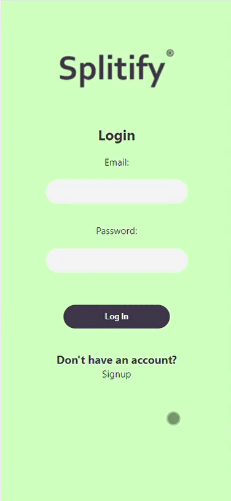
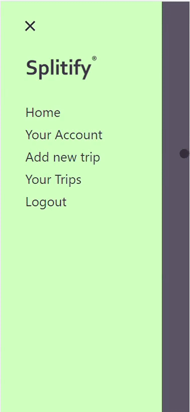
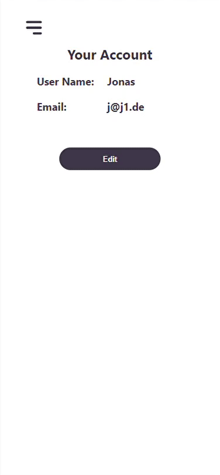
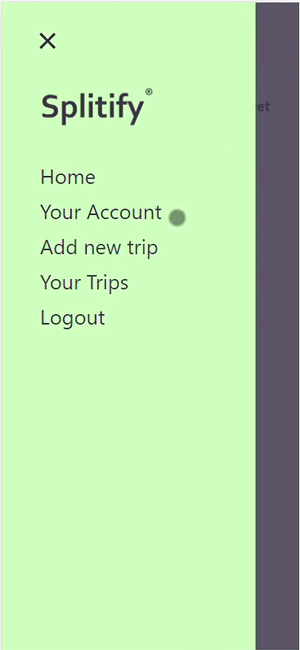
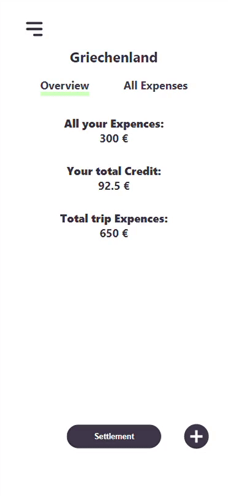
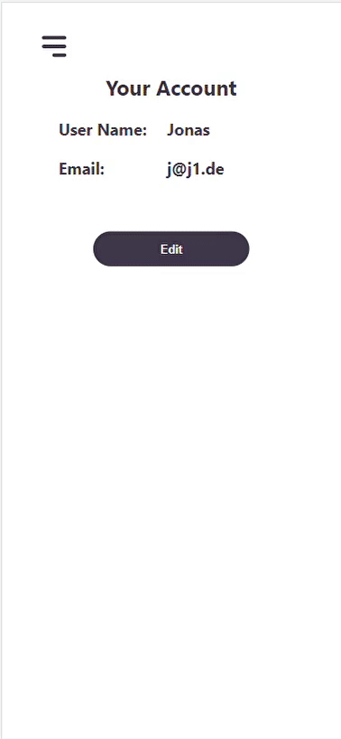
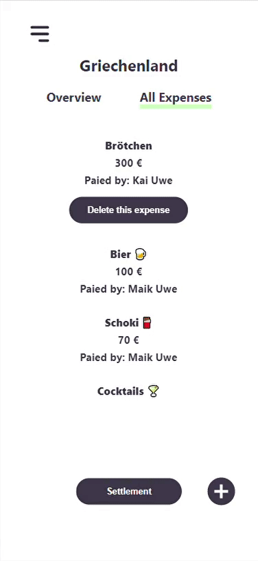

# What is Splitify?

Splitify is a vacation split app designed to help keep track of finances.

# How does it work?

<div style="display: flex; flex-direction: column; width: 465px; height: fit-content; margin: 20px 0">

<!-- Block 00 -->

<div style="display: flex; justify-content: flex-start">

<div style="display: flex; justify-content: center; align-items: center; heigth: 500px">
<h3 style="margin: 30px">Sign up to create your personal account.</h3>
</div>



</div>

<!-- Block 01 -->

<div style="display: flex; justify-content: flex-end">

<div style="display: flex; justify-content: center; align-items: center; heigth: 500px">
<h3 style="margin: 30px">Create a new trip and add all fellow travelers.</h3>
</div>



</div>

<!-- Block 02 -->

<div style="display: flex; justify-content: flex-start">

<div style="display: flex; justify-content: center; align-items: center; heigth: 500px">
<h3 style="margin: 30px">The fellow travelers will be informed about the invitation via a real-time pop-up.</h3>
</div>



</div>

<!-- Block 03 -->

<div style="display: flex; justify-content: flex-end">

<div style="display: flex; justify-content: center; align-items: center; heigth: 500px">
<h3 style="margin: 30px">After accepting the invitation, all travelers can create new expenses. The exact breakdown of the expenses can be divided into shares, for example if a person in the restaurant ordered more.</h3>
</div>



</div>

<!-- Block 04 -->

<div style="display: flex; justify-content: flex-start">

<div style="display: flex; justify-content: center; align-items: center; heigth: 500px">
<h3 style="margin: 30px">Under the heading "Settlement" you can see exactly who owes whom how much, or who has what credit balance with the other party.</h3>
</div>



</div>

<!-- Block 05 -->

<div style="display: flex; justify-content: flex-end">

<div style="display: flex; justify-content: center; align-items: center; heigth: 500px">
<h3 style="margin: 30px">Once a person has transferred the amount owed, they can mark it as paid.</h3>
</div>



</div>

<!-- Block 06 -->

<div style="display: flex; justify-content: flex-start">

<div style="display: flex; justify-content: center; align-items: center; heigth: 500px">
<h3 style="margin: 30px">As soon as a person has marked the open amount as paid, the recipient is informed in real time and can then mark the payment as received.</h3>
</div>



</div>

</div>

## Do you want to try it?

<a href="http://myvacation-app.herokuapp.com/"> >>> Splitify App</a>

## Do you want to run the code localy?

- Fork this repo
- Clone this repo

Change following file:

client > src > context > socket.js

<b>change</b> setSocket(io('http://myvacation-app.herokuapp.com')) <b>to</b> setSocket(io('http://localhost:3000'))
(this has to be changed twice in this file)

Add a .env file in the root directory:

```
JWT_SECRET='someSecret'
```

First terminal window
```shell 01
$ cd vacation_app
$ npm install
$ npm run dev
```
Second terminal window
```shell 02
$ cd client
$ npm install
$ npm start
```

